# dgraph-bench

A benchmark program for dgraph.

## Benchmark Results

All tests are on servers with multi-way Intel(R) Xeon(R) CPU E5-2630 v3 @ 2.40GHz,
32 virtual cores on each server.

Each server has 64G memory, and a 500GB SATA SSD:

| Parameter            | Evaluation           |
|----------------------|----------------------|
| Max Sequential Read  | 560 MBps             |
| Max Sequential Write | 530 MBps             |
| 4KB Random Read      | 95,000 IOPS          |
| 4KB Random Write     | 84,000 IOPS          |

### Simple Node Insertion

Af the first step, we tried to insert single node into dgraph, in different
cluster configurations.

#### 1 zero, 1 alpha, 100 concurrent goroutines, no index (v1.0.9)

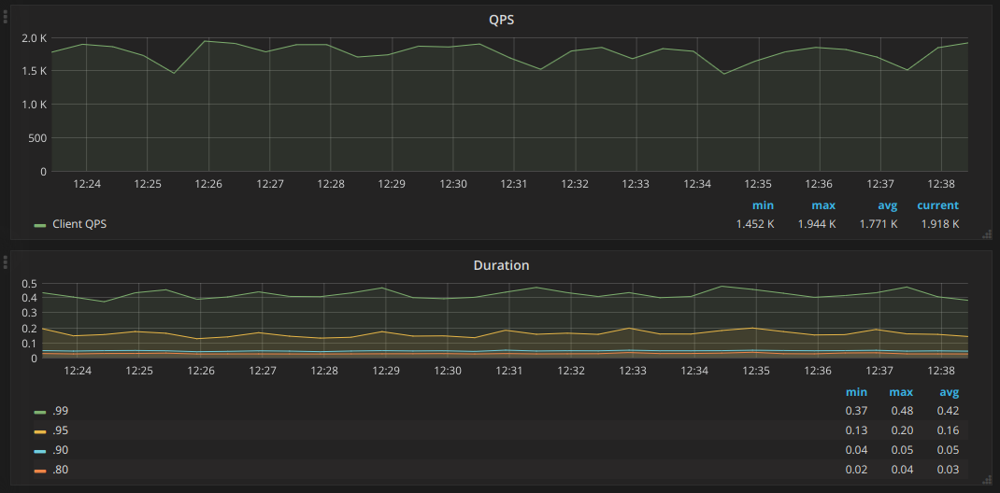

The performance is not bad, considered that the concurrency is 100 and there is
a 20ms cool down for each call. Meanwhile the CPU load is low:

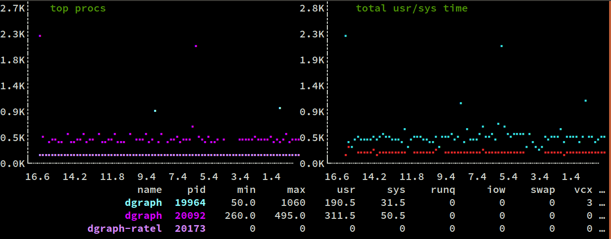

#### 1 zero, 3 alpha, 100 concurrent goroutines, no index (v1.0.9)

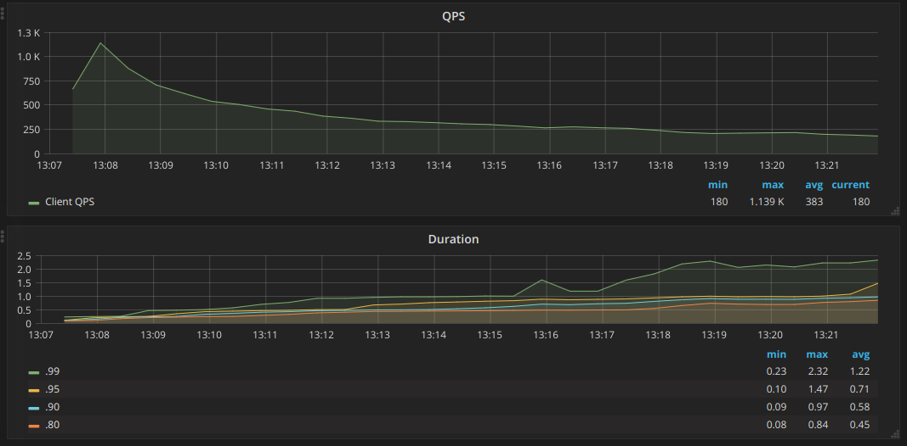

Now we see a poor performance. The CPU load is still not high:

Machine 1 (with zero and ratel):

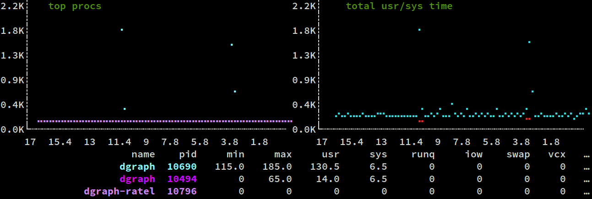

Mchine 2 and 3:

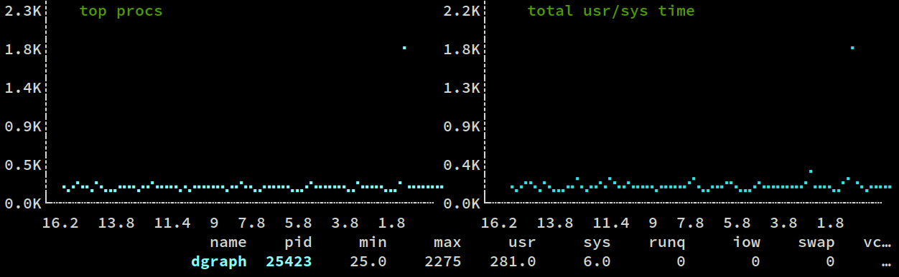
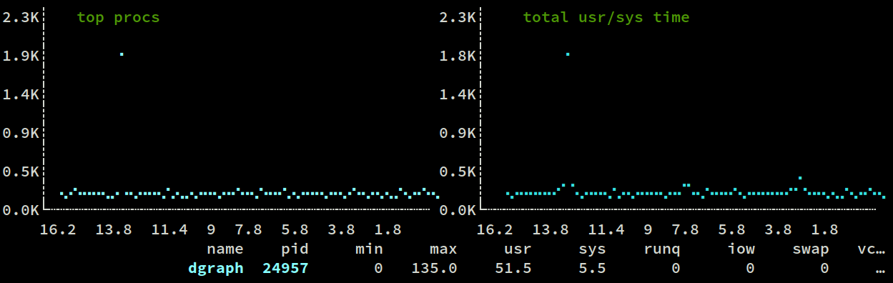

After one hour of running, we noticed a performance jump, followed by the same
performance drop.

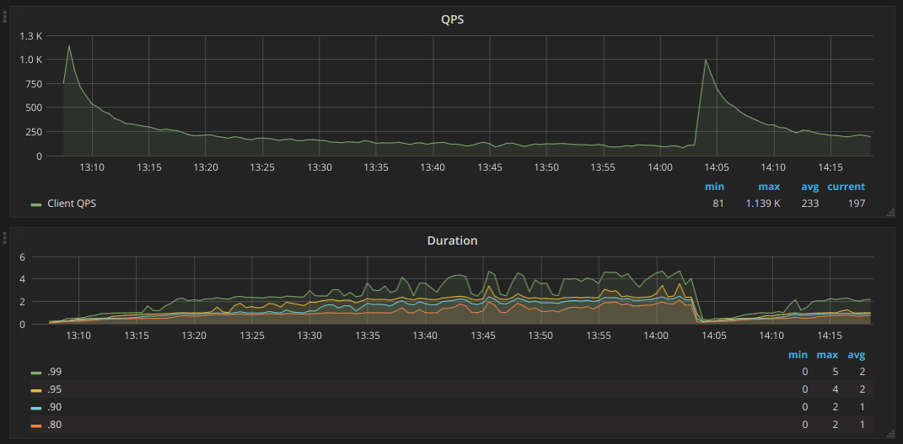

#### 1 zero, 3 alpha, 100 concurrent goroutines, with index (v1.0.9)

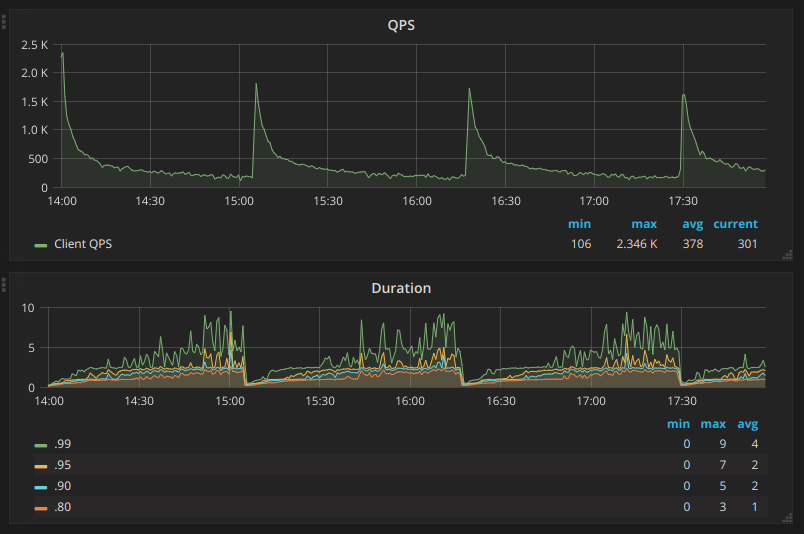

We see a clear pattern in which the performance jump up followed by a
exponential drop down.

### Edge Insertion

Before testing edge insertion, we inserted 3.3+ million people nodes to dgraph.
In this test, it picks randomly two persons, then connects them as friends.

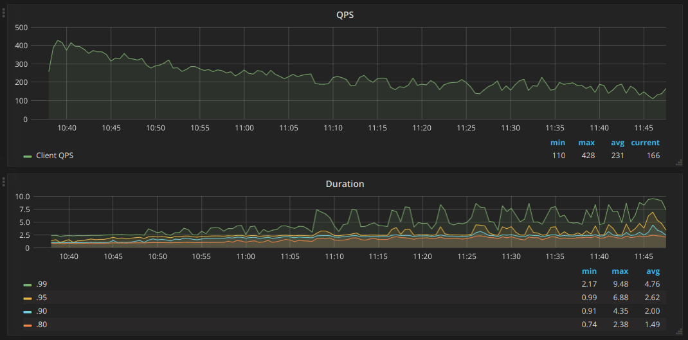

The edge insertion is also slow, with a continuous descreasing trend. As always,
the server side CPU load is rather low.

In 25 hours it inserts 8+ million edges:

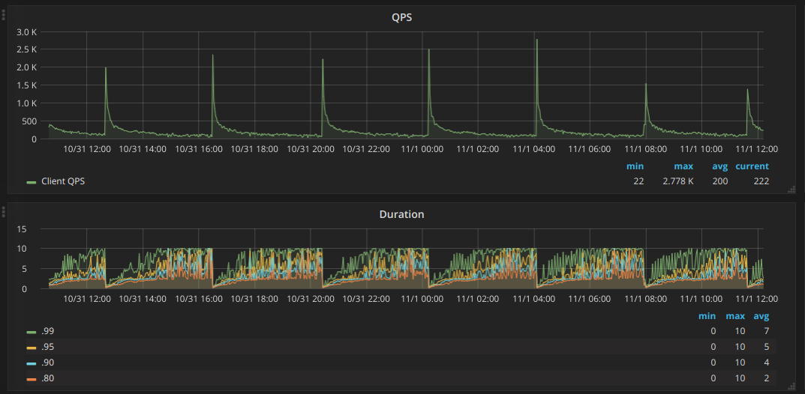

Note that the QPS jumps up every four hours followed by an exponential drop.

In summary, dgraph's insertion performance is not so good.

### Query Performance

To test Dgraph's query ability, we generated 10,000,000 person nodes, for
each of them we randomly generated N edges with randomly picked people, where N
is governed with a exponential decay curve:

N(t) = N0 * e-k*t

N0 = 1000. So the numbers of friends of most of people are below 20,
but some people will have a few hundreds of friends. The total edges all
together exceeds 500,000,000.

Since it will be very slow to insert these many nodes and edges in Dgraph, we
used dgraph bulk loader to load the generated RDF file.

#### My Friends (One-Hop Friends)

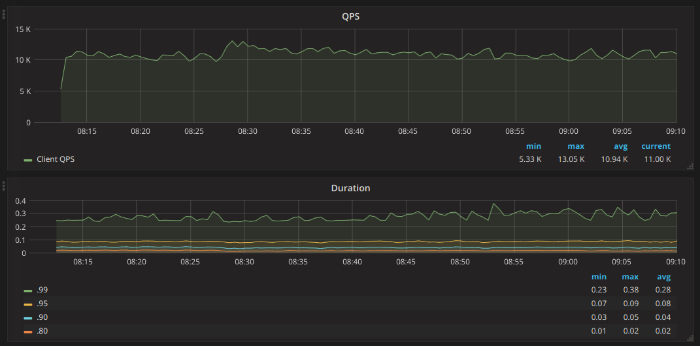

#### My Friends' Friends (Two-Hop Friends)

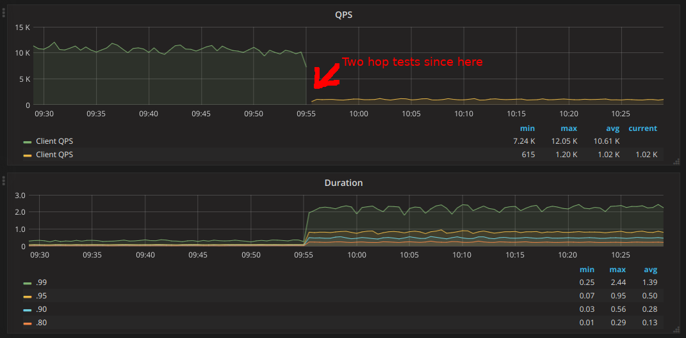

The query performance of Dgraph is superb. For one-hop friends query, it can
easily handle 10k QPS on 100 concurrent request workers at ~300ms 99 percentile
and 80ms 95 percentile. On two-hop friends query, dgraph provides ~1000 QPS on
~0.95s 95% percentile.

## Summary

Dgraph aims to provide a highly available and highly scalable graph database,
but in the latest version (1.0.9) we only see it succeed on read queries. Its
write performance is low and unstable. This result is quite surprising, because as
a LSMT data store it's expected to be good at write over read. Right on the
contrary, its read performance is much better.

Our tests also show that when mixed with writes, the read performance degraded
severely.

So at present, we prefer not use Dgraph for OLTP applications, or at least
those with heave writes. And we hope Dgraph team increase its write performance
in future releases.
